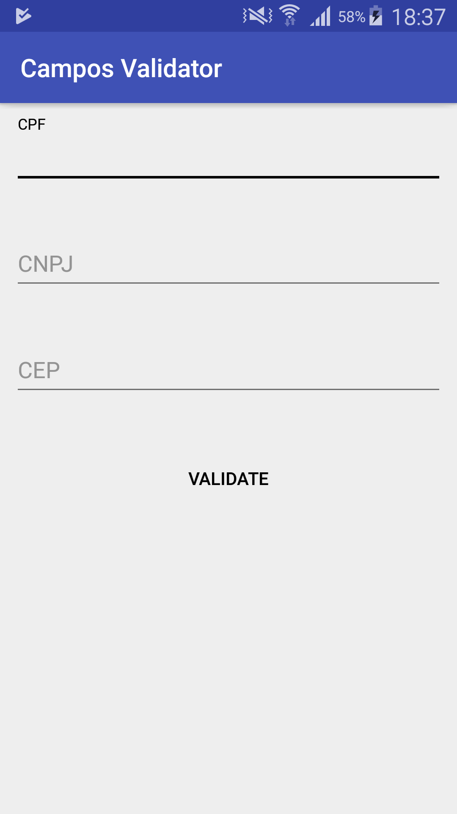
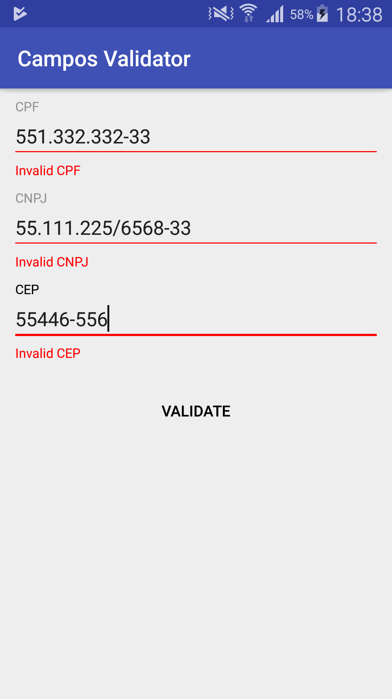
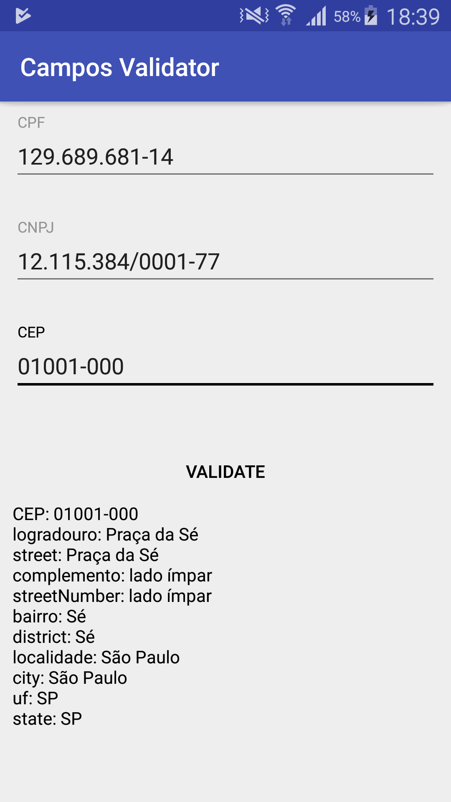

# Campos Validator
Android library to validate the fields such as `CPF`, `CNPJ`, `CEP`

# Sample Screenshots




# Usage

## Views
Although you can use default `EditText` but you can also use the views from the library which already has format related to each field. You don't have to specify any `input type` also.

**CPF**
```
<com.campos.validator.library.views.CPF
    android:layout_width="match_parent"
    android:layout_height="wrap_content" />
```
**CNPJ**
```
<com.campos.validator.library.views.CNPJ
    android:layout_width="match_parent"
    android:layout_height="wrap_content" />
```
**CEP**
```
<com.campos.validator.library.views.CEP
    android:layout_width="match_parent"
    android:layout_height="wrap_content" />
```

## Validation
**CPF & CNPJ**

Validate CPF and CNPJ with just following line. Each CPF and CNPJ is validated using predefined Algorithm. 
```
Validator.isValidCPF(CPF);
Validator.isValidCNPJ(CNPJ);
```
**CEP**

To check if CEP has valid format or not, use the following line.
```
Validator.isValidFormatCEP(CEP);
```
If your CEP is valid you can get all details related to CEP by just one following line.
```
// get the CEP details
CEPHandler.getInstance().validateCEP(CEP.getValue(), this /*CEPResponse callback*/);
``` 
the response is provided in the following three functions
```
@Override
public void CEPSuccess(CEPModel cepModel) {
	// response is success
    System.out.println(cepModel.toString());
}

@Override
public void CEPInvalid() {
    // cep is invalid
}

@Override
public void CEPError(String error) {
	// error getting cep details
    System.out.println(error);
}
```
If the response is successful, then `CEPModel` class has the details replated to CEP. For each filed, this class has getters to get the value. All the details are fetched from the url [https://viacep.com.br/](https://viacep.com.br/).

**CEPModel**
```
CEP: 01001-000
logradouro: Praça da Sé
street: Praça da Sé
complemento: lado ímpar
streetNumber: lado ímpar
bairro: Sé
district: Sé
localidade: São Paulo
city: São Paulo
uf: SP
state: SP
```


# License

    Copyright (c) 2018, Deepak Goyal under Apache License. 
    All rights reserved.
    Redistribution and use in source and binary forms, with or without
    modification, are permitted provided that the following conditions are met:
    
    - Redistributions of source code must retain the above copyright
      notice, this list of conditions and the following disclaimer.
    
    - Redistributions in binary form must reproduce the above copyright
      notice, this list of conditions and the following disclaimer in the
      documentation and/or other materials provided with the distribution.